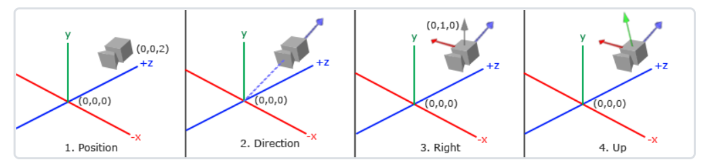
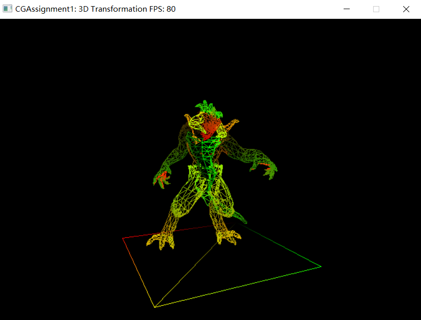
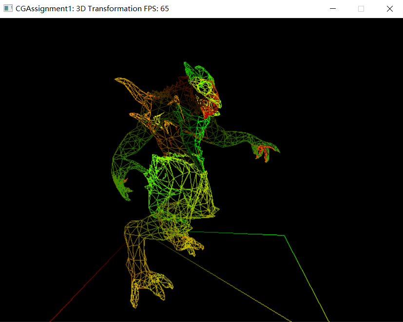
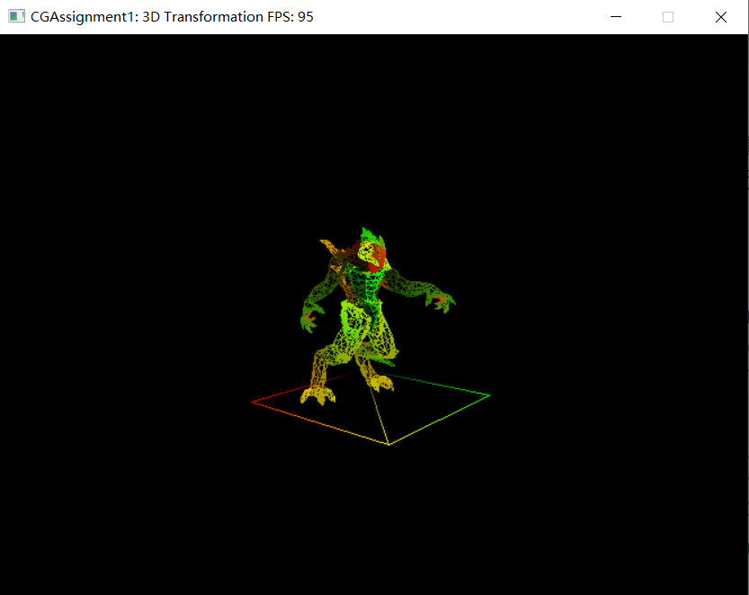
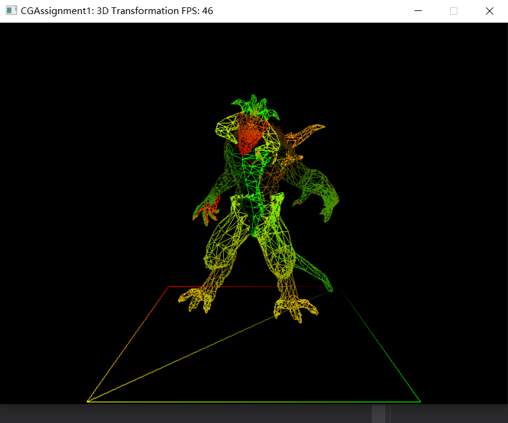
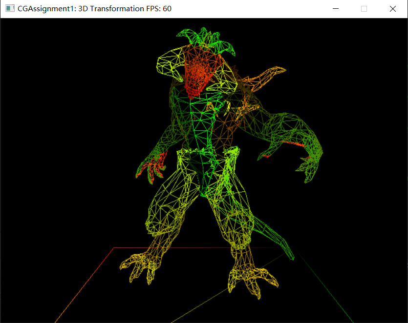
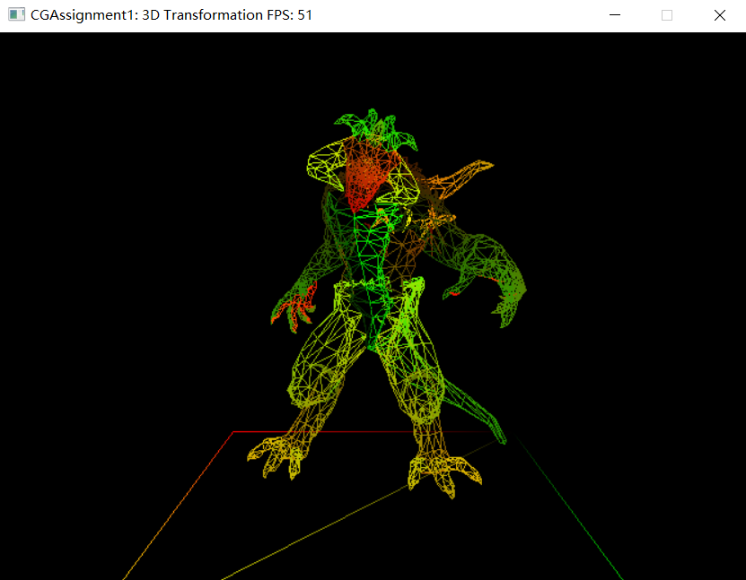
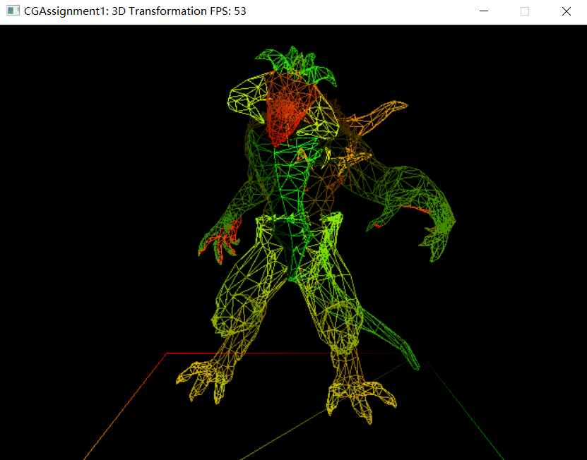

# <center>Assignment 1: 3D Transformation </center>

## <center>19335111 李俞乐</center>


## Task 1、实现观察矩阵的计算

**观察矩阵的作用就是将一个点从世界坐标系转换到观察坐标系，点的坐标参数会改变，但是点的实际位置并没有发生变化**

**首先我们需要确定以摄像机位置为原点的观察坐标系的三个坐标轴**

* **摄像机方向**

  摄像机方向为由摄像机位置指向目标点位置，即由目标点指向向量减去摄像机的指向向量，但是由于摄像机指向观察坐标系`Z`轴的负方向，若想要方向向量`cameraDirection` 指向`Z`轴正方向，即由目标位置指向摄像机位置，则需要调整一下向量减法的顺序。

  **方向向量`cameraDirection`**

  ```C++
  glm::vec3 cameraDirection = camera - target;
  ```

  

* **右向量**

  右向量`cameraRight`代表摄像机空间（观察坐标系）的`X`轴正方向，将世界上向量`worldUp`和方向向量`cameraDirection`作叉乘即可获得右向量`cameraRight`，即 $cameraRight = worldUp \cross cameraDirection$，并且向量叉乘的顺序不能改变

  **右向量`cameraRight`**

  ```c++
  glm::cameraRight = glm::cross(worldUp, cameraDirection)
  ```

  

* **上向量**

  上向量`cameraUp`代表摄像机空间（观察坐标系）的`Y`轴正方向，再 将方向向量`cameraDirection`和右向量`cameraRight`作叉乘即可获得上向量`cameraUp`，即 $cameraUp = cameraDirection \cross cameraRight$

  **上向量`cameraUp`**

  ```c++
  glm::cameraUp = glm::cross(cameraDirection, cameraRight);
  ```

  




分别将右向量、上向量和方向向量归一化即可得到摄像机空间中的三个基向量，设$\vec I, \ \vec J, \ \vec K$则是观察坐标系中的三个基向量，$\vec O$ 是摄像机的指向向量，即点$O$是观察坐标系的原点，则有
$$
\left[
\begin{array}{l}
	x_p\\
	y_p\\
	z_p\\
    1\\
\end{array}
\right]

=

\left[
\begin{array}{l}
	\vec I & \vec J & \vec K & \vec O\\
	0 & 0 & 0 & 1\\
	
\end{array}
\right]
\cdot
\left[
\begin{array}{l}
	x_p\\
	y_p\\
	z_p\\
    1\\
\end{array}
\right]

=

\left[
\begin{array}{l}
	I_x & j_x & K_x & O_x\\
	I_y & J_y & K_y & O_y\\
	I_z & J_z & K_z & O_z\\
	0 & 0 & 0 & 1\\
\end{array}
\right]
\cdot
\left[
\begin{array}{l}
	x_p'\\
	y_p'\\
	z_p'\\
    1\\
\end{array}
\right]
\\

因此有 \ 
\left[
\begin{array}{l}
	I_x & J_x & K_x & O_x\\
	I_y & J_y & K_y & O_y\\
	I_z & J_z & K_z & O_z\\
	0 & 0 & 0 & 1\\
\end{array}
\right]
^{-1}
\cdot
\left[
\begin{array}{l}
	x_p\\
	y_p\\
	z_p\\
    1\\
\end{array}
\right]

 = 
 
 \left[
\begin{array}{l}
	x_p'\\
	y_p'\\
	z_p'\\
    1\\
\end{array}
\right]
$$


而观察矩阵`view`目标是将$(x_p, \  y_p, \  z_p)$转化为$(x_p', \ y_p', \ z_p')$， 
$$
M_{view} =
\left[
\begin{array}{l}

	I_x & J_x & K_x & O_x\\
	I_y & J_y & K_y & O_y\\
	I_z & J_z & K_z & O_z\\
	0 & 0 & 0 & 1\\
\end{array}
\right]
^{-1}

=
 \left(
 \left[
 \begin{array}{l}
	1 & 0 & 0 & O_x\\
	0 & 1 & 0 & O_y\\
	0 & 0 & 1 & O_z\\
	0 & 0 & 0 & 1\\
\end{array}
\right]

\cdot
 \left[
\begin{array}{l}
	I_x & J_x & K_x & 0\\
	I_y & J_y & K_y & 0\\
	I_z & J_z & K_z & 0\\
	0 & 0 & 0 & 1\\
\end{array}
\right]

\right )
^{-1}
\\
\\
=
\left[
\begin{array}{l}
	I_x & J_x & K_x & 0\\
	I_y & J_y & K_y & 0\\
	I_z & J_z & K_z & 0\\
	0 & 0 & 0 & 1\\
\end{array}
\right]
^T
\cdot

 \left[
 \begin{array}{l}
	1 & 0 & 0 & -O_x\\
	0 & 1 & 0 & -O_y\\
	0 & 0 & 1 & -O_z\\
	0 & 0 & 0 & 1\\
\end{array}
\right]


=
 \left[
 \begin{array}{l}
	I_x & I_y & I_z & -(I_x \times O_x + I_y \times O_y + I_z \times O_z)\\
	J_x & J_y & J_z & -(J_x \times O_x + J_y \times O_y + J_z \times O_z)\\
	K_x & K_y & K_z & -(K_x \times O_x + K_y \times O_y + K_z \times O_z)\\
	0 & 0 & 0 & 1\\
\end{array}
\right]

\\
\\
= 
 \left[
 \begin{array}{l}
	I_x & I_y & I_z & - \vec I \cdot \vec O\\
	J_x & J_y & J_z & - \vec J \cdot \vec O\\
	K_x & K_y & K_z & - \vec Z \cdot \vec O\\
	0 & 0 & 0 & 1\\
\end{array}
\right]
$$
根据以上的推导结果为观察矩阵`vMat`赋值即可。


**实现代码**

```c++
glm::mat4 TRRenderer::calcViewMatrix(glm::vec3 camera, glm::vec3 target, glm::vec3 worldUp)
	{
		//Setup view matrix (world space -> camera space)
		glm::mat4 vMat = glm::mat4(1.0f);

		//Task 1: Implement the calculation of view matrix, and then set it to vMat
		//  Note: You can use any glm function (such as glm::normalize, glm::cross, glm::dot) except glm::lookAt
                            
        glm::vec3 cameraUp, cameraRight, cameraDirection;
        cameraDirection = glm::normalize(camera - target);
        cameraRight = glm::normalize(glm::cross(worldUp, cameraDirection));
        cameraUp = glm::normalize(glm::cross(cameraDirection, cameraRight));

        for (int i = 0; i < 3; i++) {
            vMat[i][0] = cameraRight[i];
			vMat[i][1] = cameraUp[i];
            vMat[i][2] = cameraDirection[i];
		}

        vMat[3][0] = -(glm::dot(cameraRight, camera));
        vMat[3][1] = -(glm::dot(cameraUp, camera));
        vMat[3][2] = -(glm::dot(cameraDirection, camera));
		
		return vMat;
	}
```


## Task 2、 实现透视投影矩阵（Project Matrix）的计算  

**投影矩阵的作用是实现从观察空间（摄像机空间）到裁剪空间的转换，参数$fovy$表示视锥体竖直方向上的张开角度，而参数$near$和$far$ 则分别表示近裁剪面和远裁剪面与摄像机之间的距离，通过以上三个参数可以计算出两个裁剪面的高度，即**
$$
Height_{near} = 2 \times near \times tan(\frac{fovy}{2}) \\
Height_{far} = 2 \times far \times tan(\frac{fovy}{2})
$$
**而参数aspect的定义为 $aspect = width / height$，则通过参数aspect可以计算出截面的宽度**


**根据相似三角形原理可以利用以上四个参数来确定投影矩阵，即**

$$
M_{persp} = 
\left[
 \begin{array}{l}
	\frac {1} {aspect \cdot tan(fovy / 2)} & 0 & 0 & 0\\
	0 & \frac {1} {tan(fovy / 2)} & 0 & 0\\
	0 & 0 & - \frac{far + near}{far - near} & -\frac{2far \cdot near}{far - near} \\
	0 & 0 & -1 & 0\\
\end{array}
\right]
$$


**代码实现**


```C++
glm::mat4 TRRenderer::calcPerspProjectMatrix(float fovy, float aspect, float near, float far)
	{
		//Setup perspective matrix (camera space -> clip space)
		glm::mat4 pMat = glm::mat4(1.0f);

		//Task 2: Implement the calculation of perspective matrix, and then set it to pMat
		//  Note: You can use any math function (such as std::tan) except glm::perspective
                    
        pMat[0][0] = 1 / (aspect * std::tan(fovy / 2));
        pMat[1][1] = 1 / std::tan(fovy / 2);
        pMat[2][2] = -(far + near)/(far - near);
        pMat[3][2] = -2 * far * near / (far - near);
        pMat[2][3] = -1;
        pMat[3][3] = 0;
           
        //pMat = glm::perspective(fovy, aspect, near, far);
		return pMat;
	}
```


## Task 3、实现视口变换矩阵（Viewport Matrix）的计算  

**视口变换矩阵的作用是实现从归一化的设备坐标到（NDC）空间到屏幕空间的转换，屏幕空间的尺寸为 $width \times height$，NDC空间中的坐标范围$x \in [-1, 1],\ y \in[-1, 1]$，只需要先将$[-1,1] \times [-1, 1]$的正方形区域缩放成$width \times height$的大小，再将正方形区域的中心位置由原点平移到$[width / 2, height / 2]$，因此有**
$$
M_{viewport} = M_{Translation} \cdot M_{scale} =
 \left[
 \begin{array}{l}
	1 & 0 & 0 & width / 2\\
	0 & 1 & 0 & height / 2\\
	0 & 0 & 1 & 0\\
	0 & 0 & 0 & 1\\
\end{array}
\right]

\cdot

 \left[
 \begin{array}{l}
	width / 2 & 0 & 0 & 1\\
	0 & height / 2 & 0 & 1\\
	0 & 0 & 1 & 0\\
	0 & 0 & 0 & 1\\
\end{array}
\right]

= 

 \left[
 \begin{array}{l}
	width/2 & 0 & 0 & width / 2\\
	0 & height /2 & 0 & height / 2\\
	0 & 0 & 1 & 0\\
	0 & 0 & 0 & 1\\
\end{array}
\right]
$$
**根据以上的推导结果为视口转换矩阵赋值即可**


**实现代码**

```C++
	glm::mat4 TRRenderer::calcViewPortMatrix(int width, int height)
	{
		//Setup viewport matrix (ndc space -> screen space)
		glm::mat4 vpMat = glm::mat4(1.0f);

		//Task 3: Implement the calculation of viewport matrix, and then set it to vpMat
                
        vpMat[0][0] = width / 2; 
		vpMat[1][1] = height / 2; 
		vpMat[3][0] = width / 2; 
		vpMat[3][1] = height / 2; 
		
		return vpMat;
	}
```


**实现效果**




<div style="page-break-after:always"></div>

​					**摄像机拉近**




​					**摄像机拉远**




## Task 4

**实现代码**

```c++
			//Rotation
			{
				//Task 4: Make the model rotate around x axis and z axis, respectively
				//绕Y轴旋转
				model_mat = glm::rotate(model_mat, (float)deltaTime * 0.001f, glm::vec3(0, 1, 0));

				//绕X轴旋转
				//model_mat = glm::rotate(model_mat, (float)deltaTime * 0.001f, glm::vec3(1, 0, 0));

				//绕Z轴旋转
				//model_mat = glm::rotate(model_mat, (float)deltaTime * 0.001f, glm::vec3(0, 0, 1));
			}
```


**运行结果**

* **绕Y轴旋转**

  


<div style="page-break-after:always"></div>

* **绕X轴旋转**

  


* **绕Z轴旋转**

  


<div style="page-break-after:always"></div>


## Task 5

**声明两个静态变量`flag`，`curScale`，flag 的值为1或-1，分别递增和递减，curScale代表当前尺寸与原尺寸的比例。每经过一个时间段`deltaTime`，curScale 就更新为 curScale + flag * unit，当 curScale >= 2 时，即当前尺寸为原来大小的两倍及以上时，将 flag 赋值为 -1，表示进入尺寸递减阶段；而当 curScale <= 2 时，即当前尺寸小于等于原尺寸时，将 flag 赋值为 1，表示进入尺寸递增阶段。由于每次循环后`model_mat`已经进行了缩放，因此每次缩放的幅度为$\frac{curScale}{last}$，其中 $last$ 是上一次循环后的尺寸大小，而 $curScale$ 则是变换的目标尺寸。**

```c++
		//Scale
			{
				//Task 5: Implement the scale up and down animation using glm::scale function
                          
                static int flag = 1;
				static double curScale = 1.0;
				float unit = 0.005;
				double last = curScale;
				curScale += flag * unit;

				if ((int)curScale >= 2.0) {
					flag = -1;
				} 
				else if (curScale <= 1.0) {
					flag = 1;                
				}
                glm::vec3 trans = glm::vec3(curScale / last, curScale / last, curScale / last);
				//glm::vec3 trans = glm::vec3(1.01f, 1.01f, 1.01f);
				model_mat = glm::scale(model_mat, trans); 
				

			}
```


**效果图（动态效果见视频）**

<center class="half">
    
    
    
    
</center>


<div style="page-break-after:always"></div>

## Task 6

**正交投影矩阵的作用是实现从摄像机空间到齐次空间的转换，其变换过程相当于将一个长方体转换为一个中心在原点、大小为 $2 \times 2 \times 2$的正方体，因此该过程可以分为以下两个部分：**

* **平移**

  **将长方体的中心平移到原点，长方体的中心坐标为$(\frac{right + left}{2}, \frac{top + bottom}{2}, \frac{near + far}{2})$，则长方体需要平移的幅度为$(-\frac{right + left}{2}, -\frac{top + bottom}{2}, -\frac{near + far}{2})$，因此平移矩阵为**
  $$
  M_{Translate} =
  \left[
   \begin{array}{l}
  	1 & 0 & 0 & \frac{right + left}{2}\\
  	0 & 1 & 0 & -\frac{top + bottom}{2}\\
  	0 & 0 & 1 & -\frac{near + far}{2}\\
  	0 & 0 & 0 & 1\\
  \end{array}
  \right]
  $$
  
* **缩放**

  **将大小为$(right - left) \times (top - bottom) \times (near - far)$的长方体缩放成大小为$2 \times 2 \times 2$的正方体，因此缩放矩阵为**
  $$
  M_{Scale} =
  \left[
   \begin{array}{l}
  	\frac{2}{right - left} & 0 & 0 & 0\\
  	0 & \frac{2}{top - bottom} & 0 & 0\\
  	0 & 0 & \frac{2}{near - far} & 0\\
  	0 & 0 & 0 & 1\\
  \end{array}
  \right]
  $$

**而最终正交投影矩阵$M_{ortho} = M_{Scale} \cdot M_{Translate}$**


**实现代码**

```c++
glm::mat4 TRRenderer::calcOrthoProjectMatrix(float left, float right, float bottom, float top, float near, float far)
	{
		//Setup orthogonal matrix (camera space -> homogeneous space)
		glm::mat4 pMat = glm::mat4(1.0f);

		//Task 6: Implement the calculation of orthogonal projection, and then set it to pMat
		glm::mat4 matrixT = glm::mat4(1.0f);
		glm::mat4 matrixS = glm::mat4(1.0f);
		matrixT[3][0] = - (right + left) / 2;
		matrixT[3][1] = - (top + bottom) / 2;
		matrixT[3][2] = - (far + near) / 2;

		matrixS[0][0] =  2 / (right - left);
		matrixS[1][1] =  2 / (top - bottom);
		matrixS[1][2] =  2 / (near - far);
		pMat = matrixS * matrixT;
		return pMat;
	}
```


<div style="page-break-after:always"></div>

## Task 7 

* **正交投影**

  


* **透视投影**

  


​			观察以上两幅效果图可以看出，在正交投影中，在投影之后的物体大小与物体所在位置与摄像机之间的距离无关，因此底部模型的正方形在正交投影之后变了长方形的形状，而在透视投影之后变成了近大远小的形状。在总体的视觉效果上，正交投影的输出效果显得较为“臃肿”，透视投影的效果则更为自然，而在通过滚动鼠标的滚轮来拉近或拉远摄像机的位置时，透视投影的图像大小会随着摄像机的位置变化而变化，而正交投影的图像大小始终保持不变。

​		

## Task 8

**（1）正交投影会将物体转换到以原点为中心的$[-1, 1] ^3$的标准立方体中，而透视投影则是将物体转换到一个棱台状的透视平截头体中；在正交投影中物体投影后的尺寸大小与物体跟摄像机之间的距离无关，而在透视投影中，物体距离摄像机越远，投影后的尺寸就越小；正交投影是可逆的，而透视投影是不可逆的。**

**（2）模型空间 $\rightarrow$ 世界空间 $\rightarrow$ 观察空间（摄像机空间） $\rightarrow$ 裁剪空间 $\rightarrow$ 屏幕空间。裁剪空间下的顶点的$w$值是观察空间坐标下的$z$值。裁剪空间下的$w$值可用于限制$xyz$坐标值，即有$-w <= x,y,z <= w$，并且$w$值记录了点的深度信息，将被用于执行透视除法。**

**（3）正交投影变换之后，几何顶点的坐标值是被直接变换到了NDC坐标 ，但是透视投影变换之后的$xyz$坐标值不一定是在$[-1, 1]$范围内。透视除法是将裁剪空间中顶点的四个分量都除以$w$分量，将 $(x, y, z, w)$ 转化为 $(\frac{x}{w}, \frac{y}{w}, \frac{z}{w}, 1)$。在透视投影中，$z$ 坐标总是被映射为确定的值 $near$，即透视投影是非线性变换，仅使用欧式几何坐标将无法获得正确的变换矩阵，必须使用齐次坐标才能推导出透视投影的变换矩阵，而透视除法的作用就是将齐次坐标重新转换为欧式坐标。**


