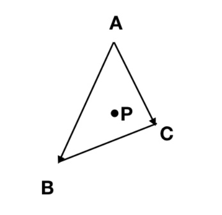

## <center>Assignment2：Rasterization_ZBuffering</center>

### <center>李俞乐 19335111</center>


### Task 1、实现Bresenham直线光栅化算法

**Bresenham算法的中心思想是通过前一步的结果递推确定下一个像素点的坐标位置，算法中需要根据 $from$ 和 $to$ 两个点所在直线的斜率进行分情况实现，设 $m$ 是直线的斜率**

* $|m|$ <= 1

  **当直线斜率小于等于1时，循环中 $x$ 坐标需要逐次移动步长 $xstep$，而 $y$ 坐标则需要根据判断的结果来确定是否需要移动 $ystep$，步长 $xstep$ 和 $ystep$ 的绝对值均为1，且符号分别与 $\Delta x$ 和 $\Delta y$ 的符号相同，即**
  $$
  xstep =
  \begin{cases} 
  1,  & \mbox{if }\Delta x \mbox{ < 0} \\
  -1, & \mbox{if }\Delta x \mbox{ > 0}
  \end{cases}
  \\
  ystep =
  \begin{cases} 
  1,  & \mbox{if }\Delta y \mbox{ < 0} \\
  -1, & \mbox{if }\Delta y \mbox{ > 0}
  \end{cases}
  $$
  

  **算法需要执行 $|\Delta x| - 1$ 次循环，每次循环都需要对 $P_i$ 的值进行判断后再确定下一个像素点的 $y$ 坐标，同时需要根据 $P_i$ 递推得到 $P_{i+1}$ 的值，其迭代过程如下**
  $$
  \begin{align*}\label{2}
  
      if \ P_i  \ \le \  0 \ then  \\
      & (x_{i+1}, y_{i+1}) = (x_i + xstep, y_i)\\
      & P_{i+1} = P_i + 2 \Delta y \\ \\
       if \ P_i \ > \ 0 \ then \\
      & (x_{i+1}, y_{i+1}) = (x_i + xstep, y_i + ystep)\\
      & P_{i+1} = P_i + 2 \Delta y
  
  \end{align*}
  $$
  

  **在确定好像素点的坐标之后，需要调用函数 $VertexData::lerp(from, to, weight)$ 对该像素点进行线性插值，其中线性插值的权重 $weight = \frac {x_i - from.spos.x}{\Delta x}$，$x_i$ 为需要进行线性插值的像素点的 $x$ 坐标，完成线性插值之后还需要判断像素点的屏幕空间坐标（spos) 是否超出屏幕空间的范围，只有像素点位于屏幕范围内才将其加入数组中，否则直接将该像素点丢弃。**


* $|m| > 1$

  **$|m| > 1$ 情况下的算法实现与 $|m| \le 1 $ 是对称的，因此，只需要将$|m| \le 1 $ 的算法实现中的 $x$ 和 $y$ 的地位互换即可**


**实现结果**


**实现代码**

```c++
void TRShaderPipeline::rasterize_wire_aux(
            const VertexData& from,
            const VertexData& to,
            const unsigned int& screen_width,
            const unsigned int& screen_height,
            std::vector<VertexData>& rasterized_points) {
          // Task1: Implement Bresenham line rasterization
          // Note: You shold use VertexData::lerp(from, to, weight) for
          // interpolation,
          //       interpolated points should be pushed back to
          //       rasterized_points. Interpolated points shold be discarded if
          //       they are outside the window.

          //       from.spos and to.spos are the screen space vertices.

          // For instance:

          int delta_x = to.spos.x - from.spos.x;
          int delta_y = to.spos.y - from.spos.y;

          int xstep = 1, ystep = 1;
          if (delta_x < 0) {
            xstep = -1;
            delta_x = -delta_x;
          }
          if (delta_y < 0) {
            ystep = -1;
            delta_y = -delta_y;
          }
          glm::ivec2 pre = from.spos, cur;
          int P;

          if (delta_y <= delta_x) {
            P = 2 * delta_y - delta_x;
            for (int i = 1; i < delta_x; i++) {
              if (P <= 0) {
                cur.x = pre.x + xstep;
                cur.y = pre.y;
                P = P + 2 * delta_y;
              } else {
                cur.x = pre.x + xstep;
                cur.y = pre.y + ystep;
                P = P + 2 * delta_y - 2 * delta_x;
              }

              pre = cur;

              VertexData node = VertexData::lerp(from, to, i / delta_x);
              node.spos = cur;
              if (cur.x > screen_width || cur.y > screen_height)
                continue;
              else
                rasterized_points.push_back(node);
            }
          } else {
            P = 2 * delta_x - delta_y;
            for (int i = 1; i < delta_y; i++) {
              if (P <= 0) {
                cur.y = pre.y + ystep;
                cur.x = pre.x;
                P = P + 2 * delta_x;
              } else {
                cur.y = pre.y + ystep;
                cur.x = pre.x + xstep;
                P = P + 2 * delta_x - 2 * delta_y;
              }

              pre = cur;

              VertexData node = VertexData::lerp(from, to, i / delta_y);
              node.spos = cur;
              if (cur.x > screen_width || cur.y > screen_height)
                continue;
              else
                rasterized_points.push_back(node);
            }
          }

          rasterized_points.push_back(from);
          rasterized_points.push_back(to);
        }
```


### Task 2、实现简单的齐次空间裁剪

**如果顶点坐标在可见的视锥体之内的话，那么 $x 、 y 、 z$ 的取值应该在 $[-w,w]$ 之间，而 $w$ 应该在 $[near,far]$ 之间。（ $near$ 和 $far$ 是视锥体的近平面和远平面），因此可以得到以下不等式 **
$$
near \le w \le far \\
-w \le x \le w\\
-w \le y \le w\\
-w \le z \le w\\
$$
**一个顶点只有同时满足以上不等式才说明其位于 $[-w, w] ^ 3$ 空间内，因此可以依次对三个顶点进行以上不等式的判断，若存在一个顶点全部满足以上不等式，则返回$ \left\{v0, v1, v2\right\}$，否则返回空集合 $\left\{ \right\}$。***


**实现结果**


​	

**镜头拉近后的效果**


**随着镜头的拉近，部分三角形的位置在屏幕之外，因此 `#ClipedFaces`的值会逐渐增加**


**代码实现**

```C++
if (v0.cpos.w >= m_frustum_near_far.x && v0.cpos.w <= m_frustum_near_far.y &&
			v0.cpos.x >= -v0.cpos.w && v0.cpos.x <= v0.cpos.w &&
			v0.cpos.y >= -v0.cpos.w && v0.cpos.y <= v0.cpos.w &&
			v0.cpos.z >= -v0.cpos.w && v0.cpos.z <= v0.cpos.w )
			return {v0, v1, v2};

		

		if (v1.cpos.w >= m_frustum_near_far.x && v1.cpos.w <= m_frustum_near_far.y &&
			v1.cpos.x >= -v1.cpos.w && v1.cpos.x <= v1.cpos.w &&
			v1.cpos.y >= -v1.cpos.w && v1.cpos.y <= v1.cpos.w &&
			v1.cpos.z >= -v1.cpos.w && v1.cpos.z <= v1.cpos.w )
			return {v0, v1, v2};


		if (v2.cpos.w >= m_frustum_near_far.x && v2.cpos.w <= m_frustum_near_far.y &&
            v2.cpos.x >= -v2.cpos.w && v2.cpos.x <= v2.cpos.w &&
            v2.cpos.y >= -v2.cpos.w && v2.cpos.y <= v2.cpos.w &&
            v2.cpos.z >= -v2.cpos.w && v2.cpos.z <= v2.cpos.w)
            return {v0, v1, v2};

		return {};
```


### Task 3、实现三角形的背向面剔除  

**背向面剔除是将背向观察者的面剔除，而在定义一组三角形顶点时，总是将三个顶点按照逆时针的顺序来定义，当该三角形是正向面时，在观察者看来，三角形顶点的顺序就是逆时针；而当该三角形是背向面时，在观察者看来，三角形顶点的顺序则是顺时针的。因此，可以通过判断三角形的顶点定义顺序是否为逆时针来决定该三角形为正向面还是反向面**

* **反向面的判断**

  **摄像机的方向（观察者视角）为 $ {camera} = (0.0f, 0.0f, -1.0f)$，设顶点 $v0, v1, v2$ 分别对应下图中三角形序号为1，2，3的顶点，$\vec m = v1 - v0, \ \vec n = v2 - v0$。当该三角形为反向面时，$\vec m$ 和 $\vec n$ 叉乘得到的向量 $\vec p = \vec m \times \vec n$ 与摄像机的方向向量 $camera$ 之间的夹角小于等于 90°，即两个向量的点乘结果小于等于零；相反，当该三角形为正向面时，向量 $\vec p$ 与方向向量 $camera$ 的点乘结果将大于零。因此有以下关系**
  $$
  ((v1 - v0) \cross (v2 - v0)) \cdot camera =
  \begin{cases} 
  Non-negative &\longrightarrow  &  \mbox{return true} \\
  negative&\longrightarrow & \mbox{return false}
  \end{cases}
  $$
  


**实现结果**

* **有面剔除的效果**

  <center class="half">
      
      
  </center>
  
  
* **无面剔除的效果**

  <center class="half">
      
      
  </center>


**对比以上效果图可以看出，无面剔除的效果图中会出现多个面重叠显示的情况，大量的图形细节会混合在一起，并且窗口上的`\#CulledFaces `数值为0；而有面剔除的效果图更为自然，没有严重的重叠显示现象，并且窗口上的`\#CulledFaces `数值均较大。**


**实现代码**

```C++
bool TRRenderer::isTowardBackFace(const glm::vec4 &v0, const glm::vec4 &v1, const glm::vec4 &v2) const
	{
		//Back face culling in the ndc space

		// Task3: Implement the back face culling
		//  Note: Return true if it's a back-face, otherwise return false.

		glm::vec3 v0_v1;		//v0指向v1
		glm::vec3 v0_v2;		//v0指向v2
		glm::vec3 camera(0.0f, 0.0f, -1.0f);		//摄像机方向
		for (int i = 0; i < 3; i++) {
			v0_v1[i] = v1[i] - v0[i];
			v0_v2[i] = v2[i] - v0[i];
		}
		double flag = glm::dot(camera, glm::cross(v0_v1, v0_v2));
		if(flag >= 0.0f) return true;  
	
		return false;

	}
```


### Task 4、实现基于Edge-function的三角形填充算法  

* **首先需要确定包围盒的范围，即确定一个 $[left, right] \times [bottom, top]$ 的矩形区域**

  ```C++
  int left = min(v0.spos.x, min(v1.spos.x, v2.spos.x));
  int right = max(v0.spos.x, max(v1.spos.x, v2.spos.x));
  int bottom = min(v0.spos.y, min(v1.spos.y, v2.spos.y));
  int top = max(v0.spos.y, max(v1.spos.y, v2.spos.y)); 
  ```

  

* **遍历 $[left, right] \times [bottom, top]$ 矩形区域内的像素点，对每个像素点求出它在三角形中的重心坐标**

  * **重心坐标的求解**

    

    **对于上图中的三角形，有以下方程**
    $$
    u \ \overrightarrow {AB} \ + \ v \ \overrightarrow{AC} \ = \ \overrightarrow {AP} \\
    \Rightarrow \  u \ \overrightarrow {AB} \ + \ v \ \overrightarrow{AC} \ + \ \overrightarrow {PA} = 0
    $$
    **即有**
    $$
    u \ \overrightarrow {AB}_x \ + \ v \ \overrightarrow{AC}_x \ +  \overrightarrow{PA}_x = 0 \\
    u \ \overrightarrow {AB}_y \ + \ v \ \overrightarrow{AC}_y \ +  \overrightarrow{PA}_y = 0
    $$
    **化成矩阵形式如下**
    $$
    \left[
    \matrix{
      u & v & 1\\
    }
    \right]
    
    \cdot
    
     \left[
    \matrix{
      \overrightarrow {AB}_x \\
      \overrightarrow {AC}_x\\
      \overrightarrow {PA}_x 
    }
    \right]
     = 0 
     \\
     \\
     \left[
    \matrix{
      u & v & 1\\
    }
    \right]
    
    \cdot
    
     \left[
    \matrix{
      \overrightarrow {AB}_y \\
      \overrightarrow {AC}_y\\
      \overrightarrow {PA}_y 
    }
    \right]
     = 0
    $$
    **即向量 $ (u, v, 1)$ 同时垂直于向量 $(\overrightarrow {AB}_x \ , \ \overrightarrow {AC}_x \ , \ \overrightarrow {PA}_x )$ 和向量 $(\overrightarrow {AB}_y \ , \ \overrightarrow {AC}_y \ , \ \overrightarrow {PA}_y )$，因此可以通过将两个向量进行叉乘来获得重心坐标，同时为了使重心的 $z$ 坐标总是等于1，这里假设重心坐标为 $(a, b, c)$，则有**
    $$
    a \ \overrightarrow {AB} \ + \ b \ \overrightarrow{AC} \ + \ c \ \overrightarrow {PA} = 0 \\
    \Rightarrow P = (1 - \frac{a}{c} - \frac{b}{c}) A  \ + \frac{a}{c}B  \ + \frac{b}{c} C
    $$
    **因此，最终的重心坐标求解代码如下，其中 $(i, j)$ 为当前像素点的坐标**

    ```c++
    glm::vec3 xvector(v1.spos.x - v0.spos.x, v2.spos.x - v0.spos.x, v0.spos.x - i);
    glm::vec3 yvector(v1.spos.y - v0.spos.y, v2.spos.y - v0.spos.y, v0.spos.y - j);
    glm::vec3 u = glm::cross(xvector, yvector);
    glm::vec3 w = glm::vec3(1.f - (u.x + u.y) / u.z, u.x / u.z, u.y / u.z);
    ```

    

* **获得像素点的重心坐标后，需要通过重心坐标来判断点是否在三角形内，当重心坐标 $w$ 的 $x, y, z$ 值均大于等于零时，该像素点位于三角形内部，否则位于三角形外；然后需要通过基于重心坐标的插值函数 $VertexData::barycentricLerp(v0, v1, v2, w)$ 获得像素点的颜色，并且重心坐标将直接作为插值函数的权重参数。最后需要判断像素点的坐标是否位于屏幕范围内，若像素点在屏幕之外，则直接丢弃该像素点。**


**实现结果**


**实现代码**

```C++
void TRShaderPipeline::rasterize_fill_edge_function(
		const VertexData &v0,
		const VertexData &v1,
		const VertexData &v2,
		const unsigned int &screen_width,
		const unsigned int &screen_height,
		std::vector<VertexData> &rasterized_points)
	{
		//Edge-function rasterization algorithm

		//Task4: Implement edge-function triangle rassterization algorithm
		// Note: You should use VertexData::barycentricLerp(v0, v1, v2, w) for interpolation, 
		//       interpolated points should be pushed back to rasterized_points.
		//       Interpolated points shold be discarded if they are outside the window. 

		//       v0.spos, v1.spos and v2.spos are the screen space vertices.

		//For instance:
        
		int left = min(v0.spos.x, min(v1.spos.x, v2.spos.x));
		int right = max(v0.spos.x, max(v1.spos.x, v2.spos.x));
		int bottom = min(v0.spos.y, min(v1.spos.y, v2.spos.y));
		int top = max(v0.spos.y, max(v1.spos.y, v2.spos.y));  
		for (int i = left; i <= right; i++) {
			for(int j = bottom; j <= top; j++){               
				glm::vec3 xvector(v1.spos.x - v0.spos.x, v2.spos.x - v0.spos.x, v0.spos.x - i);
				glm::vec3 yvector(v1.spos.y - v0.spos.y, v2.spos.y - v0.spos.y, v0.spos.y - j);
				glm::vec3 u = glm::cross(xvector, yvector);
				glm::vec3 w = glm::vec3(1.f - (u.x + u.y) / u.z, u.x / u.z, u.y / u.z);
				if ((w.x - 0.0 >= 1e-5 || fabs(w.x - 0.0) < 1e-5) && 
					(w.y - 0.0 >= 1e-5 || fabs(w.y - 0.0) < 1e-5) &&
					(w.z - 0.0 >= 1e-5 || fabs(w.z - 0.0) < 1e-5)) {

					VertexData node = VertexData::barycentricLerp(v0, v1, v2, w);
					node.spos.x = i;
					node.spos.y = j;
					
					if (i <= screen_width && j <= screen_height) {
						rasterized_points.push_back(node);
					}
				}
			}
		}
		rasterized_points.push_back(v0);
		rasterized_points.push_back(v1);
		rasterized_points.push_back(v2);


	}
```


### Task 5、

**将当前片元的深度信息`cpos.z`与当前深度缓冲的深度值进行比较，若深度缓冲的取值更小，则直接进行下一次循环。通过函数`m_backBuffer->readDepth(points.spos.x, points.spos.y)`来获得当前深度缓冲的值，而当前片元的深度信息存储在`points.cpos.z`中，将两者的数值进行比较即可**


**实现结果**


**代码实现**

```C++
for (auto &points : rasterized_points
 {
	//Task5: Implement depth testing here
	// Note: You should use m_backBuffer->readDepth() and points.spos to read the depth in buffer
	// points.cpos.z is the depth of current fragment
     
	if(m_backBuffer->readDepth(points.spos.x, points.spos.y) < points.cpos.z) continue;
	{
		//Perspective correction after rasterization
		TRShaderPipeline::VertexData::aftPrespCorrection(points);
		glm::vec4 fragColor;
		m_shader_handler->fragmentShader(points, fragColor);
		m_backBuffer->writeColor(points.spos.x, points.spos.y, fragColor);
		m_backBuffer->writeDepth(points.spos.x, points.spos.y, points.cpos.z);
	}
}
```


### Task 6、遇到的问题、困难和体会  

**遇到的问题：**

* **在实现直线光栅化的时候，由于程序的实现逻辑存在问题导致图像上会出现很多多余的线段（即模型上会出现很多毛刺），最后在重新修改了程序的实现逻辑之后得到理想的输出结果**

  

  

* **在根据重心坐标来判断像素点是否在三角形内部时，由于判断条件中没有考虑重心坐标有可能出现数值为0的分量，因此导致模型的渲染结果中出现黑线和黑点。在补充了判断条件之后，输出图像中的瑕疵消失。**

  


* **重心坐标写反，导致地板模型的颜色不是渐变的并且会出现不正常的遮挡现象。正确的重心坐标应该是 $(1 - u.x/u.z - u.y / u.z, \  u.x/u.z, \ u.y/u.z)$，但是在编写代码时，重心坐标不小心写成了 $((1 - u.x/u.z - u.y / u.z, \  u.y/u.z, \ u.x/u.z))$，最后导致地板模型的渲染结果中颜色不是渐变，而是被对角线分割为两个块颜色差距较大的区域，并且会导致上面的人物模型总是会被下面的地板模型部分遮挡，在找到错误并改正之后可以得到正确的输出结果。**

  


**体会：**

**在本次的作业中，我更加详细地理解了`Bresenham`直线光栅化算法以及基于`edge function`的三角形填充算法的基本原理，巩固了课上学习的理论知识，也熟悉了算法的具体实现过程。在一开始的时候，我还不太理解插值函数的具体作用，但是在不断查阅资料之后，我逐渐明白了不同插值函数的原理及其作用。此外，在完成作业的过程中我了解了齐次空间裁剪算法的原理，也学习了重心坐标的求解方法和重心坐标在三角形填充算法中所发挥的作用。总的来说，本次作业让我们深刻理解了模型从点到线条，再到三角形填充上色的过程，也体会到了光栅化在渲染过程中的意义，在完成作业之后，看着理想的渲染效果，我也收获了很大的成就感。**


### Task 7、实现更为精细的裁剪算法

**在齐次空间下，需要对 $ w=x, \ w=-x, \ w=y,\ w=-y, \ w=z,\ w = -z$ 六个平面进行裁剪，另外，为了保证所有齐次坐标的 `w` 坐标均为正数，这里还需要对 $w >= 1e-4$ 这个平面进行裁剪。裁剪步骤主要如下：**

* **确定点和面的关系**

  **根据以下条件来判断顶点是否为平面内，只需要根据裁剪的平面选择对应的判断条件即可，例如对 $w = x$ 平面进行裁剪，只需要判断 $x \le w$ 条件是否成立。**
  $$
  -w \le x \le w \\
  -w \le y \le w \\
  -w \le z \le w \\
  $$
  

* **若一条线段的两个顶点分别位于平面内和平面外，则需要求出交点，设交点为 $I$，则 $I = V_{from} + t(V_{to} - V_{from})$，因此只需要求出 $t$ 的值再调用线性插值函数即可。 **

  * **$t$ 的求解**

    **这里以对 $w = x$ 平面进行裁剪为例，而交点为 $I = V_1 + t(V_2 - V_1)$，则交点 $I$ 的 $x$ 坐标与 $z$ 坐标相等，则有**
    $$
    w_1 + t(w_2 - w_1) = x_1 + t(x_2 - x_1)
    $$
    **解得**
    $$
    t = \frac{w_1 - x_1}{(w_1 - x_1)-(w_2 - x_2)}
    $$
    **对其他平面进行裁剪时的 $t$ 值可以同理求解**


* **依次对七个平面进行裁剪，并且对前一个平面裁剪得到的顶点数组将作为后一个平面裁剪函数的输入，裁剪函数会将位于平面的顶点以及与裁剪平面的交点加入输出数组中，最后将经过七个平面裁剪之后得到的顶点数组返回即可。**


**实现代码**

```C++
	//裁剪函数

	void cliping_function(
            int plane,
            std::vector<TRShaderPipeline::VertexData>& vertexs,
            std::vector<TRShaderPipeline::VertexData>& output) {
          int signal = 1;
          if (plane < 0) {
				signal = -1;
				plane = -1 * plane - 1;
          }
          int num = vertexs.size();
          int flag[20];

          for (int i = 0; i < num; i++) {
            if (plane == 0) {
              if (vertexs[i].cpos.w >= 1e-4)
                flag[i] = 1;
              else
                flag[i] = -1;

              continue;
            }
            flag[i] = -1;
            if (signal == -1 && vertexs[i].cpos[plane] >= -vertexs[i].cpos.w)
              flag[i] = 1;

			else if (signal == 1 && vertexs[i].cpos[plane] <= vertexs[i].cpos.w)
              flag[i] = 1;
              
          }

          int from = num - 1, to;
          for (int i = 0; i < num; i++) {
            to = i;

            if (flag[from] * flag[to] < 0) {
              double t;
              if (plane == 0) {
					t = (1e-4 - vertexs[from].cpos.w) / (vertexs[from].cpos.w - vertexs[to].cpos.w);
              } 
			  else {
					t = (vertexs[from].cpos.w - signal * vertexs[from].cpos[plane]) /
                    ((vertexs[from].cpos.w - signal * vertexs[from].cpos[plane]) - 
                     (vertexs[to].cpos.w - signal * vertexs[to].cpos[plane]));
              }
              TRShaderPipeline::VertexData node = 
                  TRShaderPipeline::VertexData::lerp(vertexs[from], vertexs[to], t);
                
              output.push_back(node);
            }

            if (flag[to]) {
				output.push_back(vertexs[to]);
            }

            from = to;
          }
        }

        std::vector<TRShaderPipeline::VertexData> TRRenderer::cliping(
            const TRShaderPipeline::VertexData& v0,
            const TRShaderPipeline::VertexData& v1,
            const TRShaderPipeline::VertexData& v2) const {
          // Clipping in the homogeneous clipping space

          // Task2: Implement simple vertex clipping
          // Note: If one of the vertices is inside the [-w,w]^3 space (and w
          // should be in [near, far]),
          //       just return {v0, v1, v2}. Otherwise, return {}

          //       Please Use v0.cpos, v1.cpos, v2.cpos
          //       m_frustum_near_far.x -> near plane
          //       m_frustum_near_far.y -> far plane
          std::vector<TRShaderPipeline::VertexData> vertexs, 
            arr_1, arr_2, arr_3, arr1, arr2, arr3, ans;
            
          vertexs.push_back(v0);
          vertexs.push_back(v1);
          vertexs.push_back(v2);
          
          cliping_function(0, vertexs, arr1);
          cliping_function(1, arr1, arr_1);
          cliping_function(-1, arr_1, arr2); 
          cliping_function(2, arr2, arr_2);
          cliping_function(-2, arr_2, arr3); 
		  cliping_function(3, arr3, arr_3);
          cliping_function(-3, arr_3, ans);  
          
		  
          return ans;
        }
```


**实现结果**


